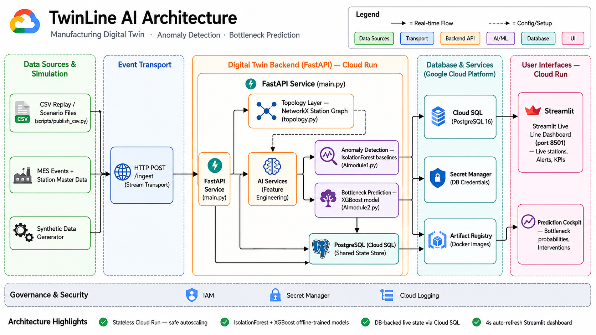
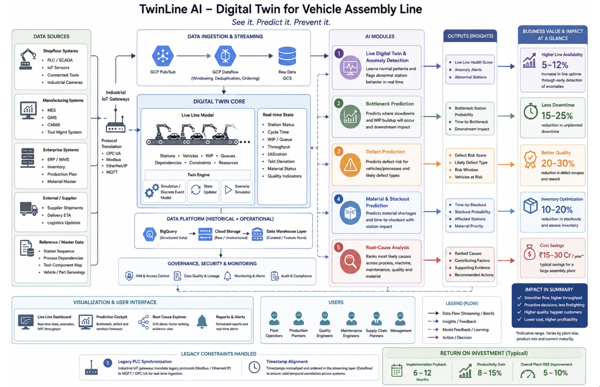
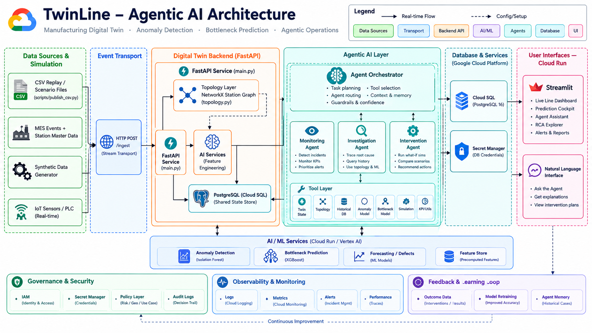

# Architecture

This document describes what TwinLine actually runs today, then separately
describes the target/vision architecture from the strategic proposal. The two
are kept distinct on purpose — see [`business-proposal.md`](./business-proposal.md)
for the roadmap that connects them.

---

## Current prototype (what actually runs)

The system is two stateless services sharing one Postgres database:

- **Backend** — a FastAPI app (`backend/main.py`) that ingests station events,
  runs two offline-trained models against each event, persists everything,
  and serves read endpoints.
- **Dashboard** — a Streamlit app (`dashboard/app.py`) that polls the backend
  every `TWINLINE_REFRESH_MS` (default 4s) and renders live state, alerts,
  predictions, and business KPIs.

Both are built as separate Docker images (`backend/Dockerfile`,
`dashboard/Dockerfile`) and run either via `docker-compose.yml` locally or as
two independent Cloud Run services in production, backed by Cloud SQL.

### Why DB-backed state instead of in-process memory

`state_store.py` reads every station's recent history, moving averages, and
neighbor WIP from Postgres on every request rather than keeping it in a
per-process cache. This is a deliberate trade-off: it costs a DB round-trip
per event, but it means every backend instance sees the same state and
nothing resets on restart — which matters because Cloud Run can run multiple
instances of the backend concurrently and scale to zero when idle. An
in-memory cache would give each instance its own, inconsistent view of the
line.

### Model training and fallback behavior

Both AI modules are trained **offline** and loaded as artifacts at startup;
neither trains online from live traffic.

| Model | Trained by | Artifact | Fallback if artifact is missing |
|---|---|---|---|
| Anomaly detection (`AImodule1.py`, `StationAnomalyDetector`) | `train_anomaly_baseline.py` | `backend/anomaly_baseline.joblib` — per-station mean/std baseline + IsolationForest | Falls back to per-request z-score statistics only, no IsolationForest component |
| Bottleneck prediction (`AImodule2.py`, `BottleneckPredictor`) | `train_bottleneck_model.py` | `backend/bottleneck_model.json` — XGBoost classifier | Falls back to a heuristic formula |

`main.py` checks for both artifacts at startup and logs which mode each
model is running in — this is the first thing worth checking when
predictions look off. Both training scripts consume the same normal-operation
CSVs under `data/normal_data/`.

---

## Data flow

For every ingested event (`POST /ingest`), in order:

1. **Normalize** — `station_status` is trimmed/title-cased.
2. **Derive features** — `state_store.compute_serving_features()` pulls the
   last `RECENT_WINDOW` (10) events for that station from Postgres and
   computes `previous_wip`, rolling `cycle_time`/`utilization` moving
   averages, and downtime in the last `DOWNTIME_LOOKBACK_MIN` (60) minutes.
   This mirrors `featureEngineering.py`'s `TwinLineFeaturePipeline` exactly,
   so a model trained offline sees the same feature distribution online.
3. **Resolve neighbors** — `topology.py`'s NetworkX graph (built from
   `station_topology.csv`, a baked-in copy of `station_master.csv`) gives
   upstream/downstream station IDs; their latest WIP is read from Postgres.
4. **Anomaly evaluation** — `StationAnomalyDetector.evaluate()` scores the
   event against its station's baseline, producing a health score, anomaly
   score, anomaly type, and severity. Wrapped in try/except — a scoring
   failure returns a neutral "Normal" result rather than failing ingest.
5. **Bottleneck prediction** — `BottleneckPredictor.predict_station()` takes
   the raw event plus derived features (WIP growth, cycle-time trend vs.
   takt, upstream/downstream WIP) and returns a bottleneck probability, time
   to bottleneck, expected throughput impact, and a recommended
   intervention. Also wrapped in try/except with a zero-risk default.
6. **Persist** — all three (raw event, anomaly result, prediction) are
   inserted into Postgres in one transaction.
7. **Respond** — the endpoint returns the anomaly and prediction results
   inline, so a caller doesn't need a second round-trip to see the outcome
   of what it just sent.

Read endpoints (`/stations`, `/history`, `/alerts`, `/predictions`,
`/line-summary`, `/kpi`) then query the same three tables — there's no
separate read model or cache layer.

---

## Database schema

Three tables, created idempotently by `db.init_schema()` on every backend
startup (`CREATE TABLE IF NOT EXISTS`):

| Table | Written by | Key columns |
|---|---|---|
| `station_events` | `/ingest` | `timestamp_utc`, `station_id`, `vehicle_id`, `station_status`, `machine_state`, `cycle_time`, `utilization`, `vibration`, `temperature`, `current_wip`, `takt_time`, `standard_cycle_time`, `station_capacity` |
| `anomaly_results` | `/ingest` | `timestamp_utc`, `station_id`, `health_score`, `anomaly_score`, `anomaly_type`, `severity` |
| `bottleneck_predictions` | `/ingest` | `timestamp_utc`, `station_id`, `bottleneck_probability`, `predicted_time_to_bottleneck_min`, `current_wip`, `expected_wip`, `expected_throughput_impact_vph`, `recommended_intervention` |

Indexes exist on `timestamp_utc` and `(station_id, timestamp_utc DESC)` for
the "latest state per station" and "recent history per station" query
patterns used throughout `main.py` and `state_store.py`.

---

## API surface

| Method & path | Purpose |
|---|---|
| `POST /ingest` | Ingest one station event; runs anomaly + bottleneck scoring and returns both inline |
| `GET /stations` | Latest known state per station |
| `GET /history?points_per_station=N` | Recent time series per station, for charting |
| `GET /alerts` | Recent anomaly results with `anomaly_score > 0.15` |
| `GET /predictions` | Latest bottleneck prediction per station |
| `GET /line-summary` | Line-wide rollup: station count, avg health, total WIP, avg cycle time |
| `GET /kpi?hours=N` | Before/after business-value KPIs (downtime, throughput, peak WIP) over the trailing `hours` window — see below |

### The `/kpi` before/after comparison

`kpi_business_value.py` answers "what would have happened without TwinLine's
early warning?" using a single ground-truth timeline rather than a live A/B
test: **before** is simply what happened; **after** is a counterfactual
replay of the same timeline where, whenever the anomaly detector raises an
alert, an intervention is assumed to land `intervention_lag_minutes` later
and pulls that station's cycle time back toward standard for
`intervention_effect_minutes`. This is what powers the "Business KPIs" tab
in the dashboard and the headline downtime/throughput/WIP numbers.

---

## Dashboard

Streamlit app, four tabs, all reading from the backend on a fixed poll
interval (`TWINLINE_REFRESH_MS`, default 4s):

| Tab | Shows |
|---|---|
| **Live Line Dashboard** | Live per-station state table (utilization, WIP, cycle time, vibration, temperature) |
| **Live Diagnostics** | Real-time anomaly alerts |
| **Prediction Cockpit** | Bottleneck probabilities and recommended interventions per station |
| **Business KPIs** | Downtime / throughput / peak-WIP before-vs-after comparison, line-wide and per-station |

---

## Key design decisions

- **Stateless services, DB as source of truth** — enables Cloud Run's default
  autoscaling (including scale-to-zero) without losing state on restart or
  disagreeing across instances.
- **Offline-trained models with graceful fallback** — the backend never
  fails to start or serve because a model artifact is missing; it degrades
  to a documented heuristic instead, and says so in the startup log.
- **Fail-open scoring** — both `detector.evaluate()` and
  `predictor.predict_station()` are wrapped so a scoring exception returns a
  neutral/zero-risk default instead of failing the ingest request.
- **Topology baked into the image** — `station_topology.csv` is a static
  copy of `station_master.csv` shipped inside `backend/`, so the Docker image
  doesn't depend on the full `data/` folder at runtime. It must be
  regenerated by hand if the line layout changes (see `topology.py`).
- **One shared feature pipeline** — `state_store.compute_serving_features()`
  and `featureEngineering.py`'s `TwinLineFeaturePipeline` compute the same
  features the same way, so online serving matches offline training.

---

## Target / vision architecture (not yet implemented)

The diagrams below describe where the strategic proposal takes this system —
they are **not** a description of what currently runs. Today's prototype
implements 2 of the 5 AI modules shown (anomaly detection and bottleneck
prediction); defect prediction, material/stockout prediction, and root-cause
analysis are proposed, not built. Likewise, the "Agentic AI Layer" below
(orchestrator, monitoring/investigation/intervention agents, natural-language
interface) is a proposed future layer — the current system has no agents; it
is a direct FastAPI request/response service.

Target-state additions over the current prototype, per these diagrams:

- **Streaming ingestion** via GCP Pub/Sub + Dataflow (windowing, dedup,
  timestamp ordering) in place of direct HTTP `/ingest` calls, to handle
  real PLC/SCADA/IoT sources with legacy protocols (Modbus, EtherNet/IP,
  OPC UA).
- **Three additional AI modules**: defect prediction, material/stockout
  prediction, root-cause analysis — see `business-proposal.md` for what each
  is proposed to do.
- **An agentic layer** — an orchestrator routing to monitoring,
  investigation, and intervention agents with a tool layer (twin state,
  topology, historical DB, models, simulation) and a natural-language
  interface, sitting on top of the same AI/ML services.
- **Governance & security**: IAM, Secret Manager, a policy layer, and
  immutable audit logs of decisions — the current prototype has none of
  this; DB credentials are plain environment variables today (see
  `db.py`).
- **Observability**: structured logging, metrics, alerting, and performance
  tracing — the current prototype only prints to stdout at startup.
- **A feedback/learning loop**: outcome data from interventions feeding
  model retraining and agent memory — today, retraining is a manual,
  offline step (`train_anomaly_baseline.py` / `train_bottleneck_model.py`
  run by hand).

See [`business-proposal.md`](./business-proposal.md) for the phased roadmap
(Crawl → Walk → Run → Optimization → Transformative) that connects today's
prototype to this target state, and the maturity model it's built on.
