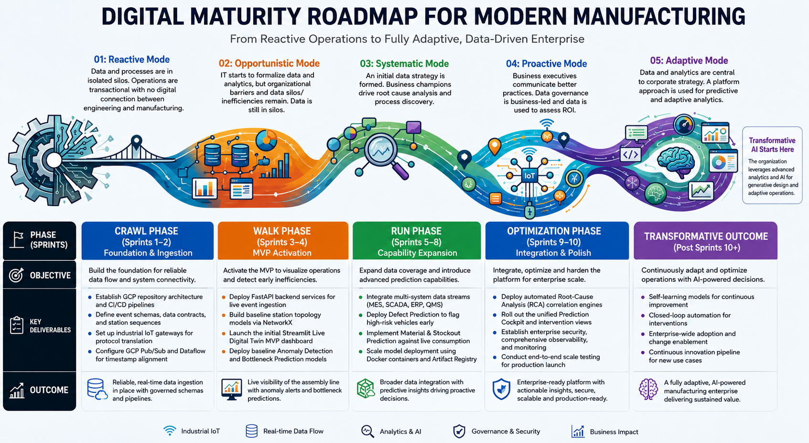

# TwinLine — Strategic Growth Proposal

> Accelerating Operational Excellence
> Team InnovAstra

This is a markdown version of the strategic proposal deck
(`Strategic_Business_Proposal.pptx` / `Strategic Business Proposal (1).pdf`
in this folder), kept in sync with it so the case for TwinLine is readable
directly on GitHub. The full deck has the original slide design; this
document has the same content in prose/table form.

**A note on scope:** this document describes the strategic case and proposed
end-state. The AI modules, ROI figures, and risk mitigations below are the
proposal — what's actually implemented today is anomaly detection and
bottleneck prediction, described precisely in
[`architecture.md`](./architecture.md). Where a figure below is a projected/
typical outcome rather than something the current prototype measures, it's
marked as such.

---

## Problem

Vehicle assembly plants run on manufacturing systems that don't talk to each
other:

1. **Siloed plant systems.** Shopfloor PLCs/SCADA, MES, ERP, and QMS each
   hold a piece of the picture, but nothing unifies them into one real-time
   view of the line.

2. **Late detection.** Without a shared live model of station state, WIP,
   and dependencies, congestion and bottlenecks are only visible after cycle
   times have already exceeded takt targets — by which point the delay is
   already downstream.

3. **Reactive firefighting, not prevention.** Operations respond to problems
   after they've happened (a stoppage, a quality escape) instead of acting
   on an early warning. Quality issues are typically caught only at final
   inspection, by which point defects have already cascaded through
   downstream stations and rework is unavoidable.

4. **Manual root-cause investigation.** When something does go wrong,
   finding out why means someone manually cross-referencing process,
   machine, maintenance, quality, and material data by hand — slow, and
   dependent on who's investigating.

5. **No leading indicator for material flow.** Component consumption isn't
   cross-referenced against inventory and supplier schedules until a
   shortage has already started to affect production.

The result, per the proposal's stated economic case, is avoidable downtime,
avoidable scrap/rework, and avoidable excess inventory — all traceable to
the same root cause: no single, real-time, shared digital twin of the line.

---

## Who We Serve

| Persona | Pain point today | What TwinLine gives them |
|---|---|---|
| **Plant Operators** | No real-time visibility into station health — issues are noticed only once they've already affected output | Live Line Dashboard: live station state, anomaly alerts, WIP, throughput — **implemented today** |
| **Production Planners** | Bottlenecks and WIP buildup are discovered only after cycle times blow past takt targets, leaving no lead time to react | Bottleneck Prediction / Prediction Cockpit: probability, time-to-bottleneck, and downstream impact, with enough lead time to intervene — **implemented today** |
| **Quality Engineers** | Quality escapes are typically caught only at final inspection, after defects have already cascaded downstream | Defect Prediction: risk-scores vehicles/processes and likely defect type before the fact — **proposed, not yet built** |
| **Maintenance Engineers** | Root-cause investigation is manual — cross-referencing process, machine, maintenance, quality, and material data by hand | Automated Root-Cause Analysis: ranked causes, contributing factors, supporting evidence — **proposed, not yet built** |
| **Supply Chain Planners** | Material shortages are discovered after they've already started to affect the line, not before | Material & Stockout Prediction: time-to-stockout, stockout probability, affected stations — **proposed, not yet built** |
| **Management** | No unified, plant-wide picture of downtime, throughput, and the financial impact of operational issues | Business KPI view: downtime/throughput/peak-WIP before-vs-after, plus the plant-level ROI case below — **implemented today** (KPI computation); plant-specific ROI validation is the proposed next step |

These personas and the module → output mapping above come directly from the
`TwinLine_Solution_Architecture.png` diagram's Users and AI Modules panels.

---

## Executive summary

TwinLine bridges the gap between siloed plant systems by uniting them into a
single, real-time shared digital twin — transitioning manufacturing
operations from reactive firefighting to proactive prevention.

- **Eliminates late detection and manual investigations** by predicting
  bottlenecks and WIP buildup before they cascade.
- **Prevents quality escapes and costly line stoppages** through early
  defect prediction, rather than catching problems only at final inspection.
- **Delivers proven economic impact** *(indicative, see note below)*: a
  5–12% increase in line availability, 15–25% lower unplanned downtime, and
  typical savings of ₹15–30 Crore/year for a large assembly plant, with a
  6–12 month payback.

> These ranges are indicative and vary by plant size, product mix, and
> current maturity — see "Key risks and mitigation" below on separating
> simulated/synthetic POC evidence from plant-specific ROI validation.

---

## Core strategic pillars

| Pillar | What it does |
|---|---|
| **Unified Real-Time Visibility** | Breaks down historical data silos by integrating MES, SCADA, ERP, and QMS platforms into one cohesive digital twin. Continuously ingests live shopfloor signals (proposed: via GCP Pub/Sub and Dataflow) to maintain an up-to-date station topology model. |
| **Proactive Congestion & Bottleneck Mitigation** | Predicts line congestion and WIP buildup before cycle times exceed takt targets, moving beyond late time-series forecasting. Gives production planners lead time to clear bottlenecks before they cause downstream delays, scrap, or stoppages. |
| **Quality Assurance & Defect Prevention** | Eliminates quality escapes usually caught only at final inspection, by analyzing live machine and process parameters. Flags high-risk vehicles and anomalies early to prevent defects cascading downstream and reduce rework. |
| **Material Flow & Inventory Optimization** | Cross-references live component consumption against inventory levels and supplier schedules to anticipate shortages. Optimizes stock levels to prevent production halts while minimizing excess carrying costs. |
| **Automated Diagnostics & Root-Cause Analysis (RCA)** | Replaces slow manual investigations with automated correlation engines linking process, machine, maintenance, quality, and material data. Generates ranked, explained contributing factors and actionable recommendations. |

**Implemented today**: the first two pillars, via anomaly detection
(`AImodule1.py`) and bottleneck prediction (`AImodule2.py`). Defect
prevention, material/inventory optimization, and RCA are proposed
capabilities — see "Roadmap" below.

---

## Technical novelty

- **Graph-aware reasoning** — a real station topology graph (NetworkX),
  not a flat table, so upstream/downstream effects are first-class.
- **Reactive + proactive intelligence** — anomaly detection (what's wrong
  now) paired with bottleneck prediction (what's about to go wrong).
- **Multi-source fusion** — designed to unify MES, SCADA, ERP, and QMS data
  rather than reasoning over one system at a time.
- **Explainable decision support** — predictions come with a recommended
  intervention, not just a score.
- **Human-in-the-loop design** — the system surfaces recommendations for
  plant operators and planners to act on; it does not act autonomously.

---

## POC scope alignment

| MVP element | TwinLine proposal alignment |
|---|---|
| Data sources | Shopfloor systems + MES-style events + reference/master data |
| Digital Twin | Live graph of stations, vehicles, WIP, and process dependencies |
| AI | Anomaly detection + proactive bottleneck prediction |
| Users | Plant Operator, Maintenance Engineer, Production Planner |
| Dashboards | Live Line Dashboard + Prediction Cockpit |
| Business outcomes | Downtime ↓, Throughput ↑, WIP ↓ |

---

## Key risks and mitigation

| Risk | Description | Mitigation |
|---|---|---|
| **Data quality** | Inconsistent timestamps, missing events, and unreliable sensors can degrade predictions. | Validation, completeness monitoring, interpretable fallback logic — the current prototype already falls back to heuristic/statistical scoring when a trained model artifact is absent (see `architecture.md`). |
| **Alert fatigue** | Excessive false positives can reduce trust. | Severity prioritization, configurable thresholds, operator feedback. |
| **Model drift** | Operating conditions and product mix change over time. | Performance monitoring, retraining, model governance. |
| **Legacy integration** | Industrial environments contain heterogeneous systems. | Modular adapters and phased pilots. |
| **Cybersecurity / safety** | Operational technology environments are critical infrastructure. | Segmented architecture, least-privilege access, and initially read-only decision support (no autonomous control actions). |
| **Adoption** | A technically capable tool can still fail if it disrupts workflows. | Role-specific dashboards and human-in-the-loop recommendations rather than automated actions. |
| **Business credibility** | Synthetic POC results are not automatically real-plant savings. | Explicitly separate simulated evidence (the current prototype runs on synthetic data — see `data/normal_data/` and `data/anomaly_data/`) from plant-specific ROI validation, which requires a live pilot. |

---

## Roadmap: digital maturity, crawl to transformative

The proposal frames TwinLine's rollout against a five-stage manufacturing
digital-maturity model (Reactive → Opportunistic → Systematic → Proactive →
Adaptive), phased as:

| Phase | Sprints | Objective | Key deliverables | Outcome |
|---|---|---|---|---|
| **Crawl** | 1–2 | Foundation & ingestion | GCP repo architecture + CI/CD, event schemas/data contracts, industrial IoT gateway protocol translation, GCP Pub/Sub + Dataflow for timestamp alignment | Reliable, real-time data ingestion with governed schemas and pipelines |
| **Walk** | 3–4 | MVP activation | FastAPI backend for live event ingestion, baseline station topology, initial Streamlit Live Digital Twin dashboard, baseline anomaly detection + bottleneck prediction models | Live visibility of the assembly line with anomaly alerts and bottleneck predictions — **this is roughly where the current prototype sits** |
| **Run** | 5–8 | Capability expansion | Multi-system data integration (MES, SCADA, ERP, QMS), defect prediction, material/stockout prediction, Docker + Artifact Registry model deployment | Broader data integration with predictive insights driving proactive decisions |
| **Optimization** | 9–10 | Integration & polish | Automated RCA correlation engine, unified Prediction Cockpit, enterprise security/observability/monitoring, end-to-end scale testing | Enterprise-ready, secure, scalable, production-ready platform |
| **Transformative** | Post-10 | Continuous adaptation | Self-learning models, closed-loop automation, enterprise-wide adoption, continuous innovation pipeline | A fully adaptive, AI-powered manufacturing enterprise delivering sustained value |

---

## Metrics that matter

Each AI module in the target architecture (`TwinLine_Solution_Architecture.png`)
produces a specific set of outputs, which in turn drive a specific business
KPI. The table below traces that chain end to end, and marks which half of
it — the technical output, the business KPI — is implemented today versus
proposed.

| AI module | Outputs (insight) | Status | Business KPI | Range (typical, indicative) |
|---|---|---|---|---|
| 1. Live Digital Twin & Anomaly Detection | Live Line Health Score, Anomaly Alerts, Abnormal Stations | ✅ **Implemented** — `AImodule1.py`, `/line-summary`, `/alerts` | Higher line availability | 5–12% increase in uptime through early anomaly detection |
| 2. Bottleneck Prediction | Bottleneck Station Probability, Time-to-Bottleneck, Downstream Impact | ✅ **Implemented** — `AImodule2.py`, `/predictions` | Less downtime | 15–25% reduction in unplanned downtime |
| 3. Defect Prediction | Defect Risk Score, Likely Defect Type, Risk Window, Vehicles at Risk | ❌ **Proposed, not built** | Better quality | 20–30% reduction in defect escapes and rework |
| 4. Material & Stockout Prediction | Time-to-Stockout, Stockout Probability, Affected Stations, Material Priority | ❌ **Proposed, not built** | Inventory optimization | 10–20% reduction in stockouts and excess inventory |
| 5. Root-Cause Analysis | Ranked Causes, Contributing Factors, Supporting Evidence, Recommended Actions | ❌ **Proposed, not built** | Cost savings | ₹15–30 Crore/year typical for a large assembly plant* |

*Indicative range — varies by plant size, product mix, and current maturity.
These are the proposal's business-value model figures, not measurements from
this POC's synthetic data. Validating them requires a live plant pilot — see
"Key risks and mitigation" above.

### Overall ROI (typical, indicative)

| Metric | Range |
|---|---|
| Implementation payback | 6–12 months |
| Productivity gain | 8–15% |
| Overall plant OEE improvement | 5–10% |

### What's actually measured today

The two implemented modules already expose real, queryable metrics — just
not yet validated against a live plant, only against synthetic data
(`data/normal_data/`, `data/anomaly_data/`):

- `GET /kpi` — downtime, throughput, and peak-WIP, before vs. after
  TwinLine's simulated early-warning intervention (`kpi_business_value.py`).
- `GET /line-summary` — line-wide average health score, total WIP, average
  cycle time.

No accuracy/precision figures for the anomaly or bottleneck models
themselves (false positive rate, precision, recall) are currently tracked
or reported anywhere in the system — that would be a reasonable next
metric to add alongside the business KPIs above.

---

## See also

- [`architecture.md`](./architecture.md) — what's actually implemented vs.
  proposed, in technical detail.
- `Strategic_Business_Proposal.pptx` / `Strategic Business Proposal (1).pdf`
  — the original slide deck this document is derived from.
- `TwinLine_Solution_Architecture.png`, `Twinline_AI_TechnicalArchitecture.png`
  — the full target-state architecture diagrams referenced in
  `architecture.md`.
